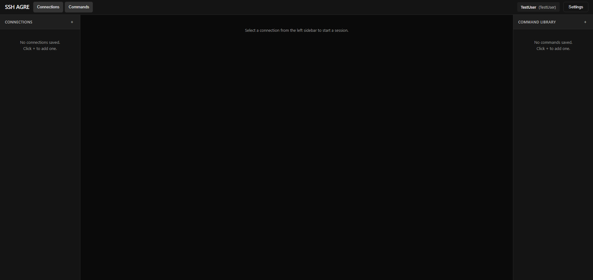
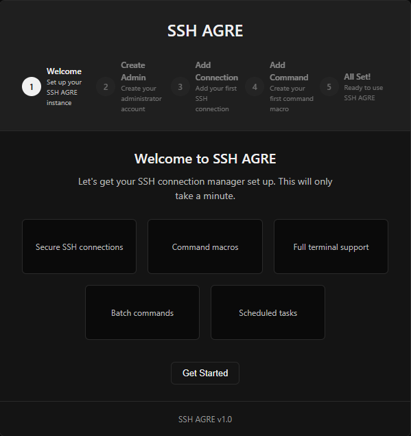
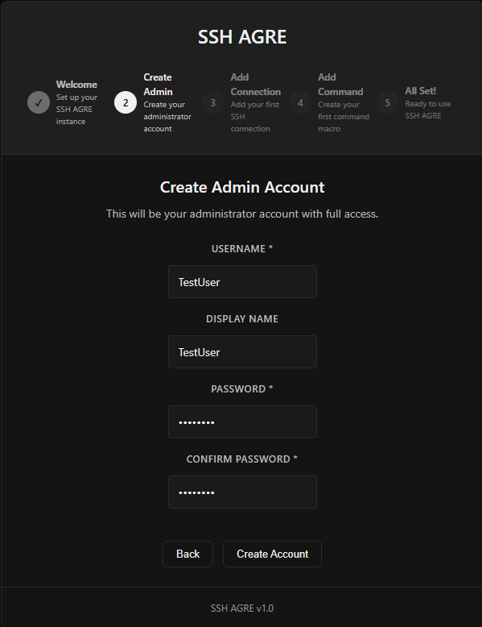
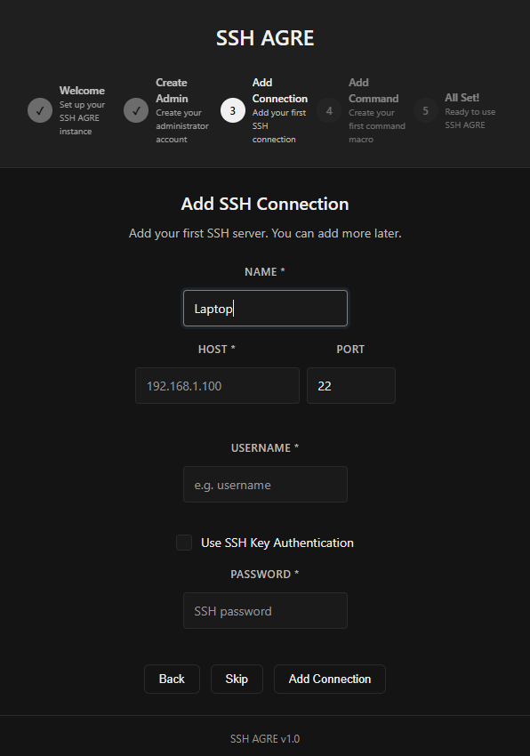
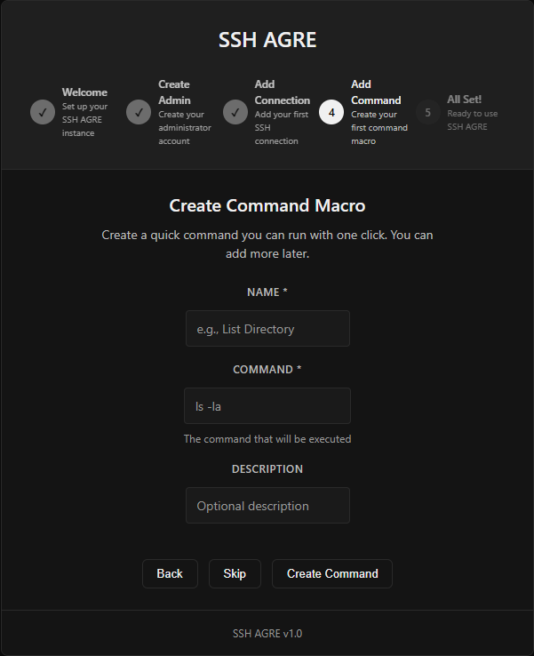
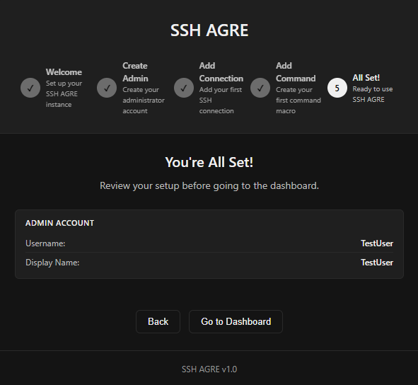

# SSH AGRE

[](https://github.com/yourusername/SSH-AGRE/releases)
[](LICENSE)
[](docker-compose.yml)

A professional SSH aggregation and management platform with a dark industrial design. Manage multiple SSH connections simultaneously through a web-based interface with persistent sessions, command automation, and role-based user management.

For technical details, system structure, and development guidelines, see our [Overview](OVERVIEW.md).

## Screenshots

<div align="center">
  
</div>

### Setup Wizard

<p align="center">
  
  
</p>
<p align="center">
  
  
</p>
<p align="center">
  
</p>

## Features

- **Multi-Session Management**: Connect to and manage multiple SSH sessions simultaneously in a tabbed interface
- **Task Scheduling**: Run commands automatically on a defined schedule with full cron expression support and logging
- **Batch Execution**: Execute command macros across multiple target servers simultaneously
- **UI Modernization**: Softened dark theme with elevated panel styling and unified inputs
- **Session Persistence**: Connections stay alive for 30+ minutes with automatic keep-alive packets
- **Web-Based Terminal**: Full terminal emulation using xterm.js with 256-color support
- **Command Library**: Create, edit, and execute predefined command macros
- **Connection Management**: Save SSH connections with credentials and quick-connect options
- **User Management**: Role-based access control with Admin and Basic user roles
- **Security**: JWT authentication, bcrypt password hashing, rate limiting, input validation

## Quick Start

### Prerequisites

- [Docker](https://docs.docker.com/get-docker/) and Docker Compose
- Or Node.js 16+ for development

### Docker Deployment

```bash
# Clone the repository
git clone https://github.com/yourusername/ssh-agre.git
cd ssh-agre

# Start the application
docker-compose up -d

# Access the application
# Frontend: http://localhost:27291
# Backend API: http://localhost:31457
```

On first run, a setup wizard will guide you through creating the administrator account and configuring your first SSH connection.

## Configuration

### Environment Variables

| Variable | Default | Description |
|----------|---------|-------------|
| `JWT_SECRET` | `ssh-agre-secret-key` | JWT signing secret - **CHANGE THIS IN PRODUCTION** |
| `PORT` | `3001` | Backend API port |
| `NODE_ENV` | `development` | Node environment |

### Docker Compose

The application runs three services:
- **Frontend** (port 3000): React web interface served by Nginx
- **Backend** (port 3001): Node.js API server
- **Data Volume**: SQLite database persistence

## Architecture

### Backend
- **Node.js** + Express REST API
- **SQLite** database for users, connections, and commands
- **SSH2** library for SSH connections
- **WebSocket** for real-time terminal I/O
- **JWT** authentication with bcrypt password hashing

### Frontend
- **React** 18 with functional components and hooks
- **React Router** for navigation
- **xterm.js** for terminal emulation
- **CSS** with CSS variables for theming

## API Endpoints

### Authentication
| Method | Endpoint | Description |
|--------|----------|-------------|
| POST | `/api/auth/setup` | Initial setup (first admin) |
| GET | `/api/auth/setup-status` | Check if setup is needed |
| POST | `/api/auth/setup-complete` | Mark setup complete |
| POST | `/api/auth/login` | User login |
| POST | `/api/auth/register` | User registration |

### Users (requires auth)
| Method | Endpoint | Description |
|--------|----------|-------------|
| GET | `/api/users/me` | Get current profile |
| PUT | `/api/users/me` | Update profile |
| DELETE | `/api/users/me` | Delete account |
| GET | `/api/users` | List all users (admin only) |
| GET | `/api/users/pending` | Pending approvals (admin) |
| POST | `/api/users/:id/approve` | Approve user (admin) |
| POST | `/api/users/:id/toggle-admin` | Toggle admin role (admin) |
| DELETE | `/api/users/:id` | Delete user (admin) |

### Connections (requires auth)
| Method | Endpoint | Description |
|--------|----------|-------------|
| GET | `/api/connections` | List connections |
| POST | `/api/connections` | Create connection |
| PUT | `/api/connections/:id` | Update connection |
| DELETE | `/api/connections/:id` | Delete connection |

### Commands (requires auth)
| Method | Endpoint | Description |
|--------|----------|-------------|
| GET | `/api/commands` | List commands |
| POST | `/api/commands` | Create command |
| PUT | `/api/commands/:id` | Update command |
| DELETE | `/api/commands/:id` | Delete command |

### WebSocket
| Endpoint | Description |
|----------|-------------|
| `WS /ws/terminal?token=<jwt>` | Terminal WebSocket for SSH sessions |

## Development

### Backend

```bash
cd backend
npm install
npm run dev
```

### Frontend

```bash
cd frontend
npm install
npm start
```

### Reset Database

```bash
docker-compose down
rm -rf ./data
rm -rf ./backend/node_modules
rm -rf ./frontend/node_modules
docker-compose up -d
```

## User Roles

### Administrator
- Full access to all features
- Can approve/deny new user registrations
- Can promote/demote users to admin
- Can delete any user account
- Can change their own username

### Basic User
- Can create and manage their own SSH connections
- Can create and manage their own command macros
- Can update display name and password
- Cannot access user management features

## Security

- **JWT Authentication**: Secure token-based auth with 24h expiration
- **Password Hashing**: bcrypt with salt rounds
- **Rate Limiting**: 100 requests per 15 minutes per IP
- **Input Validation**: All inputs validated and sanitized
- **Helmet**: HTTP security headers
- **CORS**: Configured for specific origins

## Project Structure

```
SSH-AGRE/
├── backend/
│   ├── src/
│   │   ├── db/          # Database operations
│   │   ├── middleware/  # Auth, security, validation
│   │   ├── routes/      # API routes
│   │   ├── ssh/         # SSH connection management
│   │   ├── ws/          # WebSocket handlers
│   │   └── index.js     # Server entry
│   ├── Dockerfile
│   └── package.json
├── frontend/
│   ├── src/
│   │   ├── components/  # React components
│   │   ├── contexts/    # React contexts
│   │   ├── pages/       # Route pages
│   │   ├── styles/      # CSS files
│   │   └── App.js       # App entry
│   ├── Dockerfile
│   └── package.json
├── docker-compose.yml
├── .gitignore
├── LICENSE
└── README.md
```

## Troubleshooting

### Container won't start
```bash
docker-compose logs backend
docker-compose logs frontend
```

### Database issues
```bash
docker-compose down
rm ./data/ssh_agre.db
docker-compose up -d
```

### Reset everything
```bash
docker-compose down
rm -rf ./data
docker-compose up -d --build
```

### Connecting to the host machine from SSH-AGRE
If you're running SSH-AGRE in Docker and want to SSH into the same machine, use `host.docker.internal` as the hostname instead of the machine's IP address. This resolves Docker's network namespace isolation.

## Changelog

### v0.2.2 (2026-04-20)
- Added Docker `extra_hosts` configuration for Linux to support connecting to the host machine via `host.docker.internal`
- Improved Docker Compose setup documentation for multi-platform support

### v0.2.1 (2026-04-20)
- Fixed SSH connection hanging issue where host key verification would not complete properly, leaving terminal in "blinking cursor" state indefinitely
- Added fallback handling in host key verification to ensure proper error states

### v0.2.0 (2026-04-18)
- Introduced Task Scheduling (cron jobs, history logs, and status tracking)
- Added Batch Command Execution capability
- UI overhaul: Softened dark theme with `--bg-panel` elevated cards and unified form inputs
- Hid native number spinners for a cleaner UI
- CI/CD pipeline introduced with GitHub Actions (Node 20.x)
- Resolved CodeQL and Dependabot security vulnerabilities

### v0.1.0 (2026-04-06)
- Initial release
- Multi-session SSH management
- User authentication with roles
- Command library with edit/delete
- Fixed settings modal layout
- Dark industrial theme
- Setup wizard for initial configuration

## License

MIT License - see [LICENSE](LICENSE) file

## Contributing

1. Fork the repository
2. Create a feature branch
3. Commit your changes
4. Push to the branch
5. Submit a pull request
